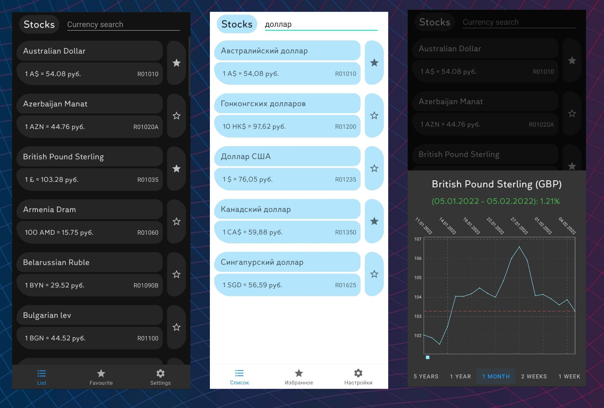
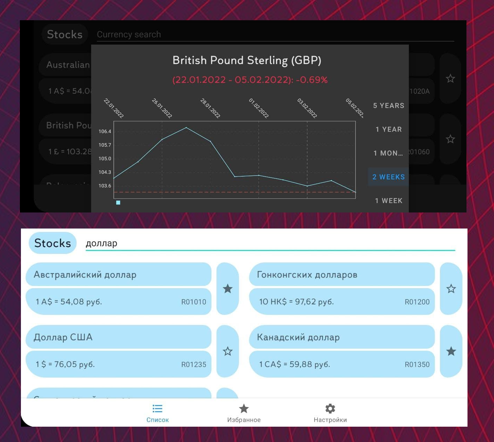

# Currency rate [Android app]

## О приложении:

Данное приложение является компилцией части моих знаний в отрасли Android разработки.

Идея создания данного проекта появилась во время *"Career Event. Яндекс"* в ИТМО. Там предложили
сделать небольшое приложение, которое будет взаимодействовать с сетью и UI, а в качестве примера
продемонстрировали API от ЦБ РФ, которое возвращает курс валют.

В данном приложении возможно добавлять курсы валют во вкладку "Избранное", после чего пользователь
может мгновенно получить к ним доступ в соответствующей фрагменте. Также присутствует приятный
дизайн, поддержка двух языков (RU/EN) и двух тем (Light/Dark).

## Используемые технологии:

В данном приложении используются: `Retrofit`, `DAO Room`, `MVVM`, `RxJava`, `Kotlin coroutines`
, `Fragments`;
Основные вычисления происходят в `Repository`

`PreferenceFragmentCompat` используется для работы с "Настройками" приложения.
`MPAndroidChart` используется для демонстрации графика с динамикой курса выбранной валюты.

Приложение переживает повороты экрана и отсутствие сети.

## Изображения приложения:

## Контакты:

🌐 Телеграм: https://t.me/MILKAsuper

✉️ Почта: svakun@gmail.com

📞 тел: +79215830737

